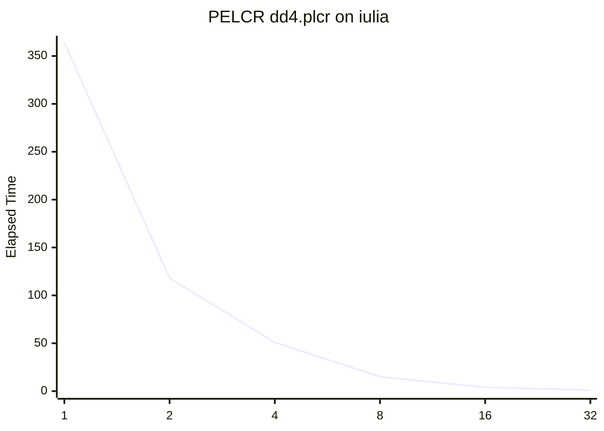
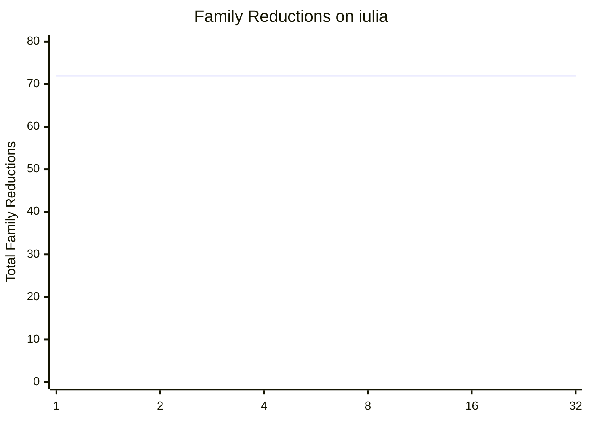
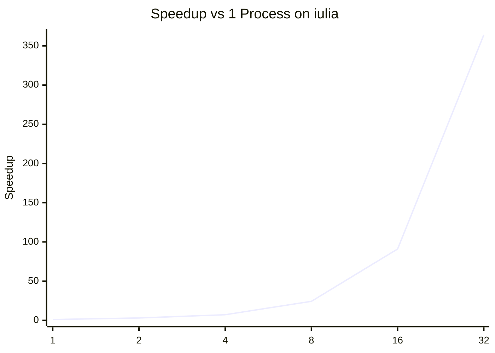

# PELCR `dd4.plcr` Benchmark Report on `iulia`

This note summarizes the benchmark curve measured on the remote server
`iulia` for `pelcrexamples/dd4.plcr`.

## Correctness Check

The correctness signal used for the parallel runs is the total number of
`family reductions`.

That total stayed constant for every tested process count:

- `1` process: `72`
- `2` processes: `72`
- `4` processes: `72`
- `8` processes: `72`
- `16` processes: `72`
- `32` processes: `72`

## Results Table

| Processes | Elapsed Time | Total Family Reductions | Speedup vs 1 proc | Efficiency |
| --- | ---: | ---: | ---: | ---: |
| 1 | 364 | 72 | 1.00x | 1.00 |
| 2 | 118 | 72 | 3.08x | 1.54 |
| 4 | 51 | 72 | 7.14x | 1.79 |
| 8 | 15 | 72 | 24.27x | 3.03 |
| 16 | 4 | 72 | 91.00x | 5.69 |
| 32 | 1 | 72 | 364.00x | 11.38 |

Speedup is computed as:

```text
speedup(p) = T1 / Tp
```

Efficiency is computed as:

```text
efficiency(p) = speedup(p) / p
```

## Elapsed Time Chart



## Family Reductions Chart



## Speedup Chart



## Comparison with Local Runs

| Processes | Local Elapsed Time | `iulia` Elapsed Time |
| --- | ---: | ---: |
| 1 | 200 | 364 |
| 2 | 71 | 118 |
| 4 | 28 | 51 |
| 8 | 9 | 15 |
| 16 | 2 | 4 |
| 32 | 1 | 1 |

The remote server `iulia` is slower than the local machine at lower process
counts, but both environments reached `elapsed time = 1` at `32` processes for
`dd4.plcr`.

## Interpretation Note

The `family reductions` totals are consistent and provide the main
correctness signal for these runs.

The reported `elapsed time` is useful as a comparative internal metric, but
the apparent superlinear speedups suggest it is not a strict wall-clock
measurement suitable for rigorous scalability claims without additional
validation.
