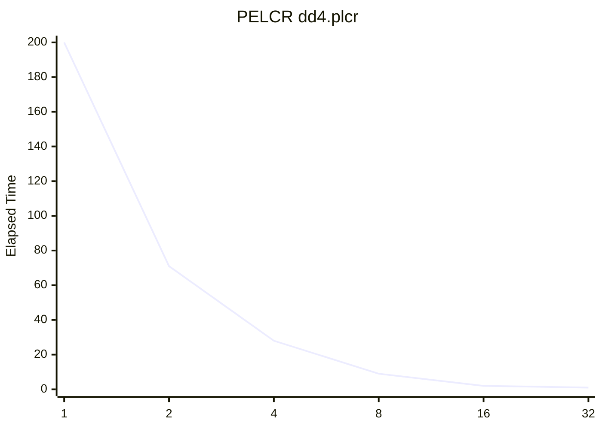

# PELCR `dd4.plcr` Parallel Run Report

This note summarizes the runs executed on `pelcrexamples/dd4.plcr` while
validating multi-process execution.

## Correctness Check

The consistency check used for parallel runs is the total number of
`family reductions`. That total stayed constant across all tested process
counts:

- Sequential (`1` process): `72`
- Parallel (`2` processes): `72`
- Parallel (`4` processes): `72`
- Parallel (`8` processes): `72`
- Parallel (`16` processes): `72`
- Parallel (`32` processes): `72`

## Results Table

| Processes | Elapsed Time | Total Family Reductions | Speedup vs 1 proc | Efficiency |
| --- | ---: | ---: | ---: | ---: |
| 1 | 200 | 72 | 1.00x | 1.00 |
| 2 | 71 | 72 | 2.82x | 1.41 |
| 4 | 28 | 72 | 7.14x | 1.79 |
| 8 | 9 | 72 | 22.22x | 2.78 |
| 16 | 2 | 72 | 100.00x | 6.25 |
| 32 | 1 | 72 | 200.00x | 6.25 |

Speedup is computed as:

```text
speedup(p) = T1 / Tp
```

Efficiency is computed as:

```text
efficiency(p) = speedup(p) / p
```

## Elapsed Time Chart



## Family Reductions Chart

```mermaid
xychart-beta
    title "Family Reductions"
    x-axis [1, 2, 4, 8, 16, 32]
    y-axis "Total Family Reductions" 0 --> 80
    line "Family Reductions" [72, 72, 72, 72, 72, 72]
```

## Interpretation Note

The `family reductions` totals are consistent and provide the main
correctness signal for these runs.

The reported `elapsed time` is useful as a comparative internal metric, but
the very high apparent speedups suggest it is not a strict wall-clock
measurement suitable for rigorous scalability claims without additional
validation.
