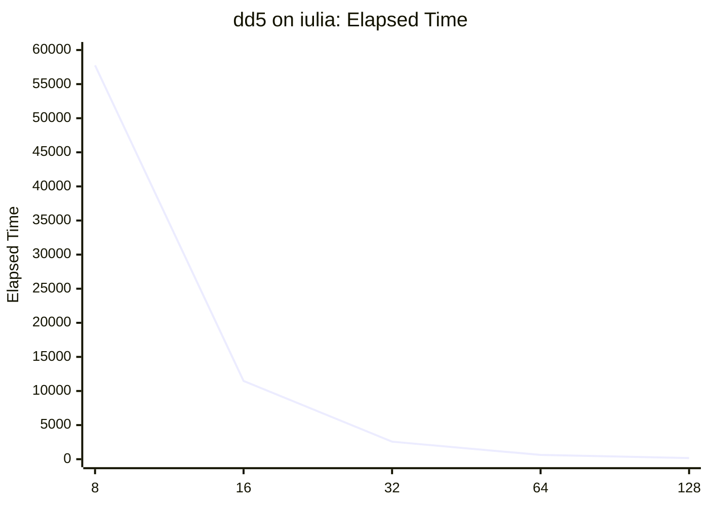
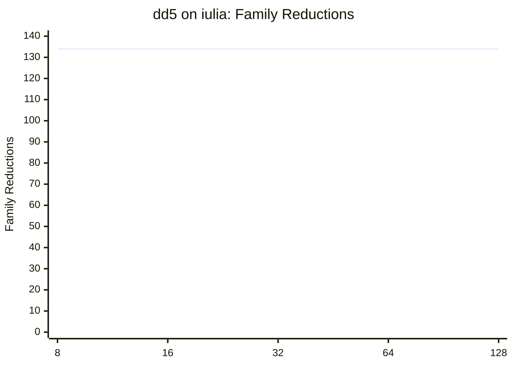
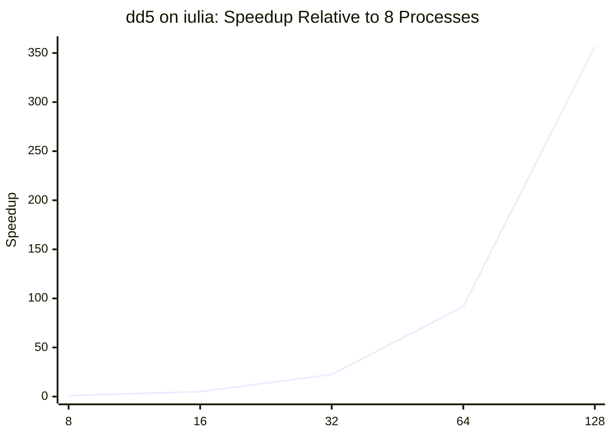

# PELCR dd5.plcr Performance Report on iulia

This report summarizes the `dd5.plcr` runs executed on `iulia`.

## Results

| Processes | Elapsed Time | Family Reductions | Notes |
|---|---:|---:|---|
| 8 | 57753 | 134 | Computation completed and produced stable totals; an earlier run showed a delayed/unstable MPI teardown. |
| 16 | 11473 | 134 | Full run completed cleanly up to `[OK] out from MPI` and `EXIT ...`. |
| 32 | 2565 | 134 | Full run completed cleanly up to `[OK] out from MPI` and `EXIT ...`. |
| 64 | 630 | 134 | Full run completed cleanly up to `[OK] out from MPI` and `EXIT ...`. |
| 128 | 162 | 134 | Full run completed cleanly; one rank reported `139`, while the other `127` ranks reported `162`, so `162` is the stable elapsed-time value for the run. |

## Derived Metrics

- Speedup from `8` to `16` processes:

  `57753 / 11473 ~= 5.03x`

- Speedup from `16` to `32` processes:

  `11473 / 2565 ~= 4.47x`

- Speedup from `8` to `32` processes:

  `57753 / 2565 ~= 22.5x`

- Speedup from `32` to `64` processes:

  `2565 / 630 ~= 4.07x`

- Speedup from `16` to `64` processes:

  `11473 / 630 ~= 18.2x`

- Speedup from `8` to `64` processes:

  `57753 / 630 ~= 91.7x`

- Speedup from `64` to `128` processes:

  `630 / 162 ~= 3.89x`

- Speedup from `32` to `128` processes:

  `2565 / 162 ~= 15.8x`

- Speedup from `16` to `128` processes:

  `11473 / 162 ~= 70.8x`

- Speedup from `8` to `128` processes:

  `57753 / 162 = 356.5x`

- Elapsed time at `128` processes:

  `162 s = 2 min 42 s`

- Elapsed time at `64` processes:

  `630 s = 10 min 30 s`

- Elapsed time at `32` processes:

  `2565 s ~= 42 min 45 s`

- Elapsed time at `16` processes:

  `11473 s ~= 3 h 11 min 13 s`

- Elapsed time at `8` processes:

  `57753 s ~= 16 h 02 min 33 s`

## Correctness Check

The total number of `family reductions` is preserved:

- `8` processes: `134`
- `16` processes: `134`
- `32` processes: `134`
- `64` processes: `134`
- `128` processes: `134`

This is the main consistency check used for the distributed run.

## Interpretation

The observed speedup is extremely strong. Even allowing for the fact that PELCR's internal `elapsed time` should not be treated as a strict external wall-clock benchmark, the progression from `57753` to `11473` to `2565` to `630` to `162` is large enough to be considered a very strong scaling result.

## Graphs

